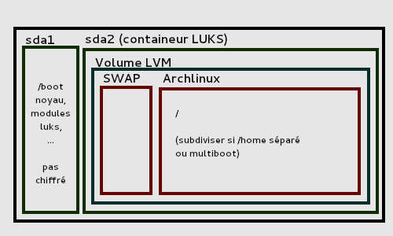
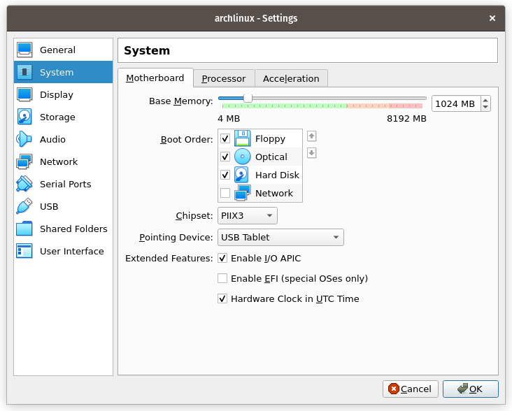
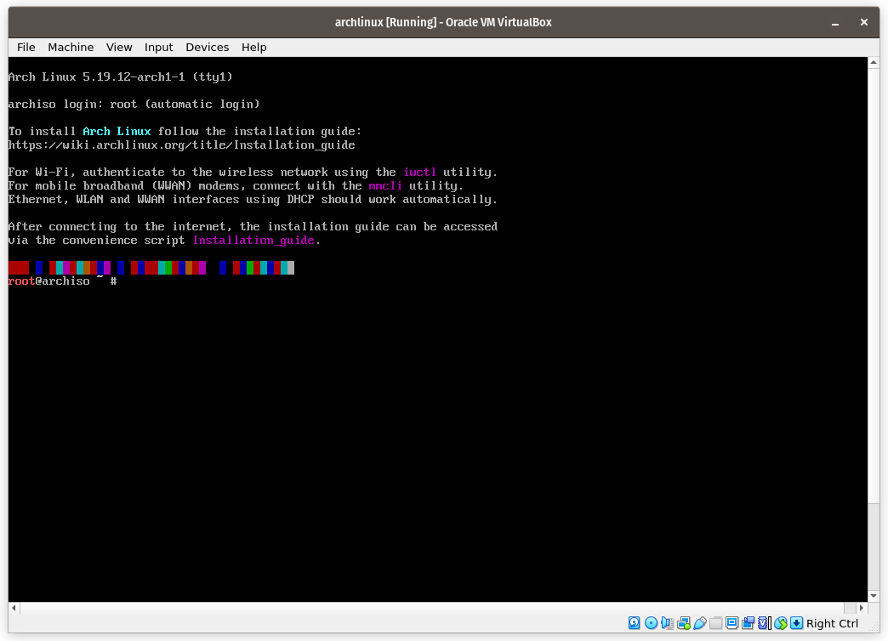

Administration système Linux : Arch Linux Install
================================================

Le but de cet exercice est d\'installer la distribution ``Arch
Linux`` configurée en ``LVM on LUKS`` avec
``systemd`` dans un hyperviseur. L\'installation d\'un
filesystem consiste à booter dans un filesystem temporaire chargé depuis
un disque, construire le filesystem définitif partition par partition,
le monter et préparer un ``bootloader`` de façon à automatiser
la séquence.

Vous pouvez utiliser l\'hyperviseur de votre choix, cependant
l\'installation, la configuration des services et la validation
automatisée n\'ont été testées que sur ``Qemu`` et
``VirtualBox``.

# Détails techniques

``Arch Linux`` est une distribution libre basée sur GNU Linux
dont le concept est de rester le plus minimaliste possible et
entièrement maintenue par une communauté très active. Il s\'agit d\'une
distribution légère et rapide, dont la procédure d\'installation
requière une bonne connaissance des systèmes informatiques.

##### Ressources nécessaires :

La machine virtuelle que vous allez créer nécessite les ressources
suivante :

-   CPU : un coeur,
-   RAM : 1 Go,
-   HDD : 20 Go

L\'iso à jour de la distribution peut être téléchargée depuis le drive
étudiant.

##### Description du système :

Le système doit être déployé sur un disque contenant deux partitions
physiques au format **GPT**. La première partition
``/dev/sda1`` contiendra le ``boot`` du système en
**EFI**. La seconde partition ``/dev/sda2`` est destinée à
accueillir un montage **LVM on LUKS** formaté en **btrfs**.


*Représentation structurelle du disque*

## Utilisation de base de Qemu

Création d\'une image disk destinée à accueillir le filesystem :

``` bash
qemu-img create -f qcow2 <image_name> <size>
```

> le format qcow2 est recommandé. Une image disk de 20Go est suffisante
pour le TP. Le fichier ``qcow2`` ne fera pas réellement 20Go,
ça sera juste sa taille maximale.

Boot depuis l'ISO d'Arch Linux :

``` bash
qemu-system-x86_64 -enable-kvm -m 1024 -boot d -cdrom <archlinux.iso> -hda <image_name>
```

-   ``qemu-system-x86_64`` permet de préciser l\'architecture du système que
    nous souhaitons émuler.
-   ``-m`` permet de préciser la quantité de RAM allouée à la VM. 1Go est
    largement suffisant.
-   ``-boot`` permet de préciser les options de boot.
-   ``-cdrom`` permet de passer une image ISO à la VM.
-  ``-hda`` permet de préciser le nom de l\'image disk à utiliser pour
    l\'installation.

Pour configurer ``Qemu``, il faudra installer le module
``ovmf`` qui permettra de booter en UEFI. Un fichier
``OVMF.fd`` se trouve typiquement dans
``/usr/share/ovmf/OVMF.fd``, il conviendra de le copier en
local, là où vous exécuterez votre commande. Sur un autre système, vous
aurez peut-être à trouver l\'emplacement de ``OVMF.fd``,
typiquement en faisant.

``` bash
$ locate OVMF.fd
/usr/somewhere/OVMF.fd
```

ajouter à la commande QEMU les paramètres suivant pour booter en UEFI :

``` bash
-drive if=pflash,format=raw,file=./OVMF.fd
```

Par défaut ``Qemu`` lance la VM en mode graphique et ouvre un
serveur VNC. Pour accéder à la VM, connectez vous sur le port indiqué.

## Utilisation de base de VirtualBox

La séquence de boot de notre installation d'Arch Linux doit être en
**EFI**. Vérifiez que l\'hyperviseur que vous avez choisi supporte ce
mode de fonctionnement. Sous ``VirtualBox``, il est nécessaire
de le configurer à la main.

``` bash
settings -> system
            motherboard -> enable EFI
```


<figcaption>Enable EFI</figcaption>

## Avant d\'aller plus loin

> Assurez vous de pouvoir atteindre internet depuis votre VM. Une
connection NAT est recommandée. N\'oubliez pas d\'activer le forwarding
sur votre hôte.

Pour tester votre connexion :

-   ``ip a`` permet de voir les interface de la carte réseau
    de la VM
-   ``ping`` permet de tester le routage et la résolution des
    noms de domaine
-   ``dhclient`` permet de demander un nouveau lease au
    serveur DHCP
-   en dernier lieu, pensez à vérifier vos règles de pare-feu

## Partition du disque



> Assurez vous que la table de partition est au format **GPT**.

Créez deux partitions :

-   sda1, comme partition de boot en EFI
-   sda2, au format linux filesystem

``` {caption="Partitionnement de l'image disk"}
sda |-> sda1             |- 512Mo EFI
    |-> sda2             |- linux filesystem
```

## Configuration LVM on LUKS

Le principe d\'un montage ``LVM on LUKS`` est de séparer la
séquence de boot du reste du filesystem qui sera entièrement chiffré. La
séquence de boot contiendra les éléments permettant de déchiffrer le
reste du système.

Utilisez cryptsetup pour préparer ``sda2``. La partition
chiffrée doit s\'appeler ``cryptlvm``. Créez ensuite un volume
virtuel que vous appellerez ``vg0``, puis deux partitions
logiques, root et swap.

``` {caption="Création des volumes logiques"}
sda |-> sda1             |- 512Mo EFI
    |-> sda2             |- (LUKS encrypted)
        |-> cryptlvm(LVM)|
            |-> root     |- 10Go 
            |-> home     |- ~8Go (100%FREE)
            |-> swap     |- 2Go
```

> Pour de plus amples information, référez vous à la documentation
officielle : [\[LVM on
LUKS\]](https://wiki.archlinux.org/title/Dm-crypt/Encrypting_an_entire_system#LVM_on_LUKS)

Attention, afin de passer les tests, le conteneur LUKS doit s\'appeler
``cryptlvm``, le Volume Group [vg0]{.title-ref} et les Logical
Volumes ``vg0-root``, ``vg0-home`` et
``vg0-swap``.

## Bootstrapping

Avant de monter notre filesystem définitif, il faut formater les
volumes.

Les volumes logiques root et home doivent être préparés en premier car
c\'est eux qui accueilleront le reste du système. Pour rappel, le volume
logique root doit être formaté en **btrfs** et monté directement dans
``/mnt``. Le volume home, aussi formaté en **btrfs** sera monté ensuite dans
``/mnt/home``. N\'oubliez pas de créer le dossier au préalable.

Le volume ``sda1`` qui contiendra la séquence de boot doit
être au format FAT 32 et sera montée dans ``/mnt/boot``.

Le volume de swap n\'a pas besoin d\'être monté mais doit être
explicitement configé pour servir de swap.

``` {caption="Représentation logique de partitionnement"}
sda |-> sda1             |- 512Mo EFI (fat 32 - /boot)
    |-> sda2             |- (LUKS encrypted)
        |-> cryptlvm(LVM)|
            |-> root     |- 10Go (btrfs - /)
            |-> home     |- ~8Go (btrfs - /home)
            |-> swap     |- 2Go
```

Une fois le filesystem construit, on peut copier les librairies
nécessaires au système définitif depuis le filesystem temporaire dans le
point de montage où se trouve le filesystem définitif.

``` bash
pacstrap -K /mnt base linux linux-firmware btrfs-progs lvm2
```

## Configurations des locales

Préparer le fstab et chrootez dans le point de montage.

``` bash
genfstab -U /mnt >> /mnt/etc/fstab 
arch-chroot /mnt 
```

Vous êtez maintenant root dans le filesystem définitif, comme si
l\'installation était terminée. Toutes les commandes que vous taperez
lorsque vous serez chrootés affecteront donc directement le filesystem
definitif.

Installez ``Arch Linux``. Les éléments ci-dessous seront
testés :

-   Vous devez configurer la bonne timezone (Paris).
-   La locale doit être configurée en ``en_US.UTF-8``.
    -   La machine doit s\'appeler ``arch[ECOLE_SUPPRIMEE]``.
-   N\'oubliez pas de synchroniser l\'horloge.
-   Installez ``systemd-networkd`` et
    ``systemd-resolved`` pour pouvoir vous connecter à
    internet au redémarrage.

C\'est le bon moment pour définir le mot de passe root dont vous aurez
besoin au redémarrage. Il s\'agit d\'une VM sur un système vérifié, donc
keep it simple.

## Préparation de l\'initramfs

L\'initramfs est configurée dans le fichier **mkinitcpio.conf**. C\'est
de fichier qui définit les modules particulier (nécessaire dans le cas
d\'une installation réelle sur un disk NVMe par exemple) et les
différents HOOKS du système nécessaires au démarage, notamment pour
permettre le déchiffrement.

-   supprimez des HOOKS ``udev`` et remplacez le par
    ``systemd``.
-   après keyboard``, ajoutez ``lvm2`` pour que le
    système prenne en compte les volumes logiques
-   après ``keyboard``, ajoutez ``sd-encrypt`` pour
    que le système déchiffre le volume chiffré au démarrage
-   après ``keyboard``, ajoutez ``sd-vconsole`` pour
    que le système prenne en compte le mapping clavier éventuellement
    configuré
-   enfin ajoutez ``btrfs`` pour que le format du volume root
    soit reconnu

``` bash
mkinitcpio -p linux 
```

Débuguez les erreurs.

## Construction du bootloader

Après avoir construit votre système, il est nécessaire de construire la
séquence de boot qui permettra de déchiffrer et de monter les
différentes partitions. La commande ``bootctl install`` permet
de peupler la partition de boot avec les éléments du filesystem.

Une fois les éléments de base construits, il est nécessaire de créer une
entrée. Cette entrée contient un ``title`` qui s\'affichera au
démarrage. La ligne la plus important est ``options`` qui doit
contenir les information permettant au système de déchiffrer le
conteneur LUKS au démarrage en utilisant ``systemd``.

``` 
rd.luks.name=<UUID>=myvolgroup root=/dev/myvolgroup/root
```

N\'oubliez pas d\'ajouter cette entrée au fichier de configuration de
boot, démontez le système :

``` 
exit
umount -R /mnt
reboot
```

puis redémarrez.

# Synthèse des items de validation

Vous aurez à ``git clone`` le projet sur votre archlinux et à
lancer le script ``sentinel [ECOLE_SUPPRIMEE]`` sur celui-ci. Le script
``sentinel`` vous générera un fichier ``tokens``
dans le dépôt et le poussera pour la validation.
Voir la documentation de "sentinel [ECOLE_SUPPRIMEE]" pour plus de détail.

| **item** | **details** | **condition** |
|---|---|---|
| **boot** | mode | efi mode |
|  | boot mount | /dev/sda1 mounted on /boot |
|  | boot type | /boot type is fat32 |
|  | systemd-boot is installed | cmd="bootctl is installed" |
|  | systemd | HOOKS contains ``systemd`` |
|  | entry | exists |
| **logical  volume management** | root is in LVM | /dev/mapper/vg0-root on / |
|  | root type | / type is btrfs |
|  | swap | swap is enabled |
|  | swap size  | 2 Go |
| **encryption** | encrypted volume name | must be cryptlvm |
|  | luks with systemd | HOOKS contain ``sd-encrypt`` |
|  | luks decrypted on boot | entry contains information |
| **general config.** | localtime | Europe/Paris |
|  | locale | en_US.UTF-8 |
|  | hostname | arch[ECOLE_SUPPRIMEE] |
| **networking** | systemd-networkd | must appear in systemctl status |
|  | systemd-resolved | must appear in systemctl status |
|  | interface | must ping google.com |

# Ressources

-   [\[Guide d\'installation de Arch
    Linux\]](https://wiki.archlinux.org/title/installation_guide)
-   [\[Guide d\'utilisation de
    Dm-crypt\]](https://wiki.archlinux.org/title/Dm-crypt/Encrypting_an_entire_system)
-   [\[systemd-boot\]](https://wiki.archlinux.org/title/systemd-boot)
-   [\[systemd-networkd\]](https://wiki.archlinux.org/title/systemd-networkd)
