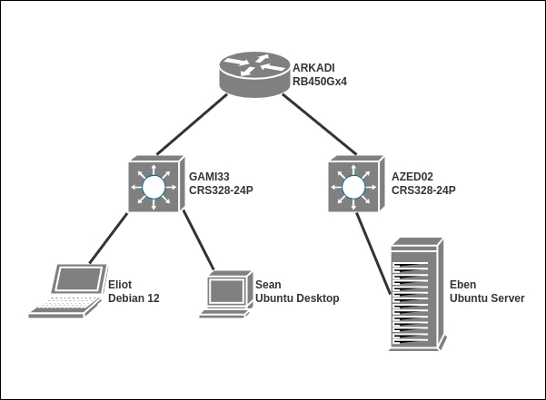

# Administration réseau et bases des protocoles: Routage

Le but de cet exercice est de simuler le système d\'information (SI) de
``CorpNet``. Le projet ``CorpNet`` étant en
gestation, son SI est réduit. ``Eliot``, qui représente le
département en charge de monter l\'infrastructure, a besoin d\'avoir
accès à toutes les machines du SI pour le déploiement des différents
services en **SSH** en tant que ``root`` via clef SSH et sans mot de passe.

## Détails techniques

### Hyperviseurs et mutualisation des ressources

Le sujet proposé ci-dessous a été entièrement testé en utilisant QEMU et
GNS3. Ce sont les outils que nous privilégions pour cet exercice.

GNS3 est un outil de simulation de réseaux utilisant de façon
relativement transparente des images dockers, des machines KVM et des
machines virtuelles externes (VirtualBox, Qemu/KVM entre autres). Pour
l\'installer sur votre système, référez vous à la [\[documentation
officielle\]](https://docs.gns3.com/docs/getting-started/installation/linux/)
(notez que la documentation est disponible aussi pour Windows et MacOS
ainsi que l\'existance d\'un package python)

	La toolbox mentionnée dans la suite fait référence à l\'espace du même
nom sur le Drive ``Students_[ECOLE_SUPPRIMEE]``. Path : Students_[ECOLE_SUPPRIMEE] \>
Students_Contents_[ECOLE_SUPPRIMEE] \> promo2027 \> A1S1_Cycle01_Bootcamp \> ToolBox

### Schéma du SI



<div class="pagebreak"></div>

Le SI de ``CorpNet`` V.1.0

| **hostname** | **Système d'exploitation** | **Type** | **Détails et paramètres** |
|---|---|---|---|
| Sean | Ubuntu 24.04 Desktop Noble Numbat | Qemu VM | -hostname : sean -SSH server activated  -ip: 10.78.120.144/24 -storage: 4G -ram 512M |
| Eliot | Debian 12 Bookworm | Qemu VM | -hostname : eliot -SSH server activated -nmap installed -ip: 10.78.120.133/24 -storage: 4G -ram 512M |
| Eben | Ubuntu 24.04 Cloud Noble Numbat | Qemu VM | -hostname : eben -SSH server activated  -ip: 10.78.120.100/24 -storage: 4G -ram 512M |
| GAMI33 | Mikrotik CRS328-24P-4S | Qemu VM | -required interfaces activated -SSH server activated -ip: 10.78.120.254/24 |
| AZED02 | Mikrotik CRS328-24P-4S | Qemu VM | -required interfaces activated -SSH server activated -ip: 10.78.16.254/24 |
| ARKADI | Mikrotik RB450Gx4 | Qemu VM | -hostname : arkadi -SSH server activated -ip: 192.168.122.2/24 -ip: 10.78.120.1/24 -ip: 10.78.16.1/24 |

La topologie virtuelle est connectée au réseau réel à travers la carte
réseau de votre ordinateur. C\'est l\'interface **NAT** de GNS3 qui
prend en charge l\'interfaçage.

## SETUP

### 1) Configuration du routeur (moyen)

Avant tout il est nécessaire de vous procurer les images Mikrotik
(fournies dans la toolbox) et créer les templates dans GNS3.

Pour éviter toute ambiguïté, les connexions qui seront testées
correspondent aux slots 1 (internal), 2 (dmz) et 5 (external).

| Interface | Champ | Valeur |
|---|---|---|
| ether 1 | subnet | 10.78.120.1/24 |
|  | connecteur | #1 |
|  | name | internal |
| ether 2 | subnet | 10.78.16.1/24 |
|  | connecteur | #2 |
|  | name | dmz |
| ether 5 | subnet | 192.168.122.2 |
|  | connecteur | #5 |
|  | name | external |
| Protocoles | telnet | enabled |
|  | ftp | disabled |
|  | www | disabled |
|  | ssh | enabled |
|  | www-ssl | disabled |
|  | api | disabled |
|  | winbox | disabled |
|  | api-ssl | disabled |
|  | NAT | masquerade |

N\'oubliez pas de configurer la route par défaut. On pourra aussi
indiquer un serveur de noms de domaine comme 8.8.8.8 par exemple.

### 2) Configuration des switchs (moyen)

Installez RouterOS (fournie dans la toolbox) sur chacun des deux switchs
Mikrotik (``GAMI33`` et ``AZED02``) et activez les
ports ethernet sur lesquels vous avez connecté les différents
périphériques. Sur les switches Mikrotik, il est nécessaire d\'ouvrir
explicitement les ports de connexion.

N\'oubliez pas de vérifier au fur et à mesure la connectivité du réseau.

Inutile de configurer des VLANs pour l\'instant. Vous aurez besoin de
donner une adresse IP aux switchs pour pouvoir vous y connecter en
**SSH** (voire le tableau de configuration).

### 3) Configuration d\'Eliot (facile)

Chargez une image Qemu de Debian 12 (fournie dans la toolbox).

``Eliot`` doit avoir accès à internet à travers
``ARKADI`` de façon persistante. Vous devez y installer un
**serveur SSH** ainsi que **nmap** et **dnsutils** pour toutes les
opérations de diagnostique réseau.

Attention: l\'installation de paquets APT requière que vous configuriez
un serveur de nom de domaine. Notre infrastructure étant en cours de
développement, choisissez l\'adresse de serveur de nom de domaine
``8.8.8.8`` par exemple.

Notez que pour économiser les ressources de votre machine, il n\'est pas
nécessaire d\'installer l\'interface graphique.

N\'oubliez pas doncfigurer le hostname.

### 4) Configuration de Sean (facile)

Chargez une image Qemu d\'Ubuntu (Desktop Guest) (fournie dans la
toolbox).

``Sean`` doivent avoir accès à internet à travers
``ARKADI``. Vous devez y installer un **serveur SSH**.

N\'oubliez pas de configurer le hostname.

### 5) Configuration d\'Eben (facile)

Chargez une image Qemu d\'Ubuntu (Cloud Guest) (fournie dans la
toolbox).

``Eben`` doit avoir accès à internet à travers
``ARKADI``. Vous devez y installer un **serveur SSH**.

N\'oubliez pas de configurer le hostname.

## SSH et connexion par clé

Secure-Shell (**SSH**) est un protocole basé sur **TCP** permettant
l\'interaction entre deux machines d\'un réseau (en général le client
agit sur le serveur) à travers une connexion chiffrée. L\'une des
utilisations principales de **SSH** est l\'administration de services
hébergés sur des périphériques distants.

Deux modes de connexion sont possibles : par mot de passe ou par clé de
connexion. Tout sur la connexion **SSH** par clé sur le site de
[\[KORBEN\]](https://korben.info/login-ssh-sans-mot-de-passe.html) .

Pour établir une connexion **\*SSH** passwordless, la démarche est
toujours sensiblement la même :

> -   côté serveur, créer un utilisateur dédier (ici ``root``
>     n\'existe pas encore sur les switchs et le routeur)
> -   autoriser la connexion avec cet utilisateur avec un mot de passe
> -   côté client générer une paire de clés de connexion **SSH** (sans
>     passphrase)
> -   injecter la clé publique dans le serveur grâce à
>     ``ssh-copy-id`` (ou toute autre technique\...)
> -   côté serveur enfin, autoriser la connexion par clé et retirer la
>     possibilité de s\'identifier par mot de passe
> -   tester la connexion

Pour les OS de la famille Debian, les paramètres de configuration du
**serveur SSH** se trouvent dans le dossier:

``` bash
/etc/ssh/sshd_config
```

N\'hésitez pas à faire un backup avant modification. Trois paramètres
sont à considérer:

> -   permettre la connexion en tant que root
> -   permettre la connexion par clé publique
> -   refuser la connexion par mot de passe

Lors de la tentative de connexion, le **serveur SSH** cherche une clé
valide dans

``` bash
~/.ssh/authorized_keys 
```

et la compare à la clé de l\'utilisateur sollicité.

**Les machines de votre topologie doivent toutes accepter les connexion
SSH en tant que \`root\` via clef SSH sans mot de passe.**

Il faut donc copier la clé publique du ``root`` d\'\`Eliot\`
dans sont propre fichier ``authorized_keys`` ainsi que dans
celui de tous les autres serveurs.

``` bash
# ssh-copy-id root@<ip address> 
```

Pour tester la configuration sur ``Eliot``, vous pouvez
essayer la commande suivante:

``` bash
$ ssh root@localhost uid
```

Qui devrait retourner :

``` bash
uid=0(root) gid=0(root) groups=0(root)
```

## Synthèse des items de validation

Vous aurez à ``git clone`` le projet sur ``Eliot``
et à lancer le script ``sentinel`` de celle-ci. Le script
``sentinel`` vous générera un fichier ``tokens``
dans le dépôt et le poussera pour la validation. Cette machine doit
pouvoir se connecter sur toutes les machines (dont elle même) via
**SSH** avec le user ``root`` avec une authentification par
clefs, sans passphrase.

| item | details | conditions |
|---|---|---|
| Eliot | hostname | eliot |
|  | ip a | in 10.78.120.0/24 |
|  | default route | via ARKADI 10.78.120.1 |
|  | dig | found |
|  | nmap | found |
| Network (eliot) | ping outside | ping 192.168.122.1 OK |
|  | ping google | ping 8.8.8.8 OK |
|  | domaine name resolution | dig www.google.com OK |
|  | packet management | apt update OK |
| Sean | ping | ping 10.78.120.144 OK |
|  | hostname | sean |
| Eben | ping | ping 10.78.16.100 OK |
|  | hostname | eben |
| SSH Config | ssh localhost | ssh <root@localhost> |
|  | ssh GAMI33 | ssh <admin@10.78.120.254> |
|  | ssh ARKADI | ssh <admin@10.78.120.1> |
|  | ssh Sean | ssh <root@10.78.120.144> |
|  | ssh AZED02 | ssh <admin@10.78.16.254> |
|  | ssh Eben | ssh <root@10.78.16.100> |
| GAMI33 | system identity print | gami33 |
|  | ip address print | ip=10.78.120.254 |
|  | default route | via 10.78.120.1 |
|  | ftp | disabled |
|  | www | disabled |
| AZED02 | system identity print | azed02 |
|  | ip address print | ip=10.78.16.254 |
|  | default route | via 10.78.16.1 |
|  | ftp | disabled |
|  | www | disabled |
| ARKADI | hostname | arkadi |
|  | ether1 | ip=10.78.120.1 name=internal |
|  | ether2 | ip=10.78.16.1 name=dmz |
|  | ether5 | ip=192.168.122.2 name=external |
|  | default route | via 192.168.122.1 |

## Ressources

-   [\[GNS3 Documentation\]](https://docs.gns3.com/docs/)
-   [\[Debian Documentation\]](https://www.debian.org/doc/index.fr.html)
-   [\[DigitalOcean sur la connexion SSH par clé\]](https://www.digitalocean.com/community/tutorials/how-to-configure-ssh-key-based-authentication-on-a-linux-server)
