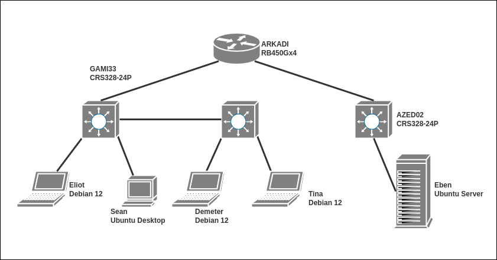

# Administration réseau et bases des protocoles: Segmentation du réseau

Cet exercice fait suite à l\'exercice `asr_02routage`. Il est préférable
d\'avoir validé l\'intégralité des tests relatifs à ce dernier avant de
s\'attaquer à celui-ci.

L\'objectif de cet exercice est d\'explorer la topologie développée lors
de la session précédente à travers l\'application de la ségmentation du
réseau au moyen de VLANs. Vous allez devoir marquer l\'intégralité du
traffic et router les différents VLANs avant d\'ajouter une nouvelle
division à Corpnet.

# Détails techniques

L\'architecture à deux niveau que nous avons déployé lors du dernier
exercice est pour l\'instant très vulnérable. 

Ségmenter le réseau et mettre à jour les règles de firewall sont des étapes nécessaire au déploiement de tout système d\'information et éventuellement même des
réseaux domestiques.

>Cet exercice vise à isoler le traffic des différentes divisions de
Corpnet. Le filtrage sera fait par port pour des raisons de simplicité.

Le tableau ci-dessous résume la segmentation envisagée :

| **vlan-ID** | **host** | **addresse** |
|---|---|---|
| 20 | Eliot | 10.78.20.133 |
| | Sean | 10.78.20.144 |
| 30 | Eben | 10.78.30.100 |

>A chaque VLAN sera attribué un range d\'adresses IP spécifique.

# 1) Déploiement des VLANs

>La mise en place de VLANs se fait en deux temps. D\'abord le marquage
des paquets (protocole 802.1Q) puis le routage inter-VLAN.

### Marquage du traffic

Pour chaque switch :

-   assurez vous que les interfaces concernées sont bien activées avec
    le hardware offloading.
-   attribuez le pvid du VLAN correspondant aux ports considérés
-   définissez une interface trunk (celle qui connecte le routeur) avec
    le vlan-id requis.
-   activez le filtrage (`frame-type=admit-all` pour l\'instant)

A ce moment vous ne devez plus avoir accès au routeur ni à internet
depuis Eliot mais si vous analysez les trames sortant de l\'interface
trunk de GAMI33, vous devez observer qu\'elles sont bien marquées avec
le `VLAN tag 20`.

### Routage inter-VLAN

Dans ARKADI, attribuez les VLANs `20` et `30` aux interfaces `internal` et `dmz`
respectivement :

`interface vlan add`

Attribuez à ces VLANs une adresse de gateway :

| VLAN | Adresse |
|---|---|
| vlan20 | 10.78.20.1/24 |
| vlan30 | 10.78.30.1/24 |

# 2) Configuration des endpoints

La mise en place de VLANs est complètement transparante pour les hôtes
connectés. Dans une infrastructure moderne, les VLANs sont associées à
un range d\'IP d\'un serveur DHCP. Cependant pour des raisons
pédagogique, nous verrons cette partie plus tard. Il va donc nous
falloir affecter les addresses des hôtes à la main. N\'oubliez pas ne
modifier la gateway.

>Les switch aussi pourront être ajoutés aux VLANs.

| Hôte | Adresse |
|---|---|
| Eliot | 10.78.20.133/24 |
| Sean | 10.78.20.144/24 |
| Eben | 10.78.30.100/24 |
| GAMI33 | 10.78.20.254/24 | 
| AZED02 | 10.78.30.254/24 |

> Assurez vous qu\'Eliot a toujours accès à Eben!

# 3) Ajout d\'un nouveau département

Demeter est la première membre du département sales de Corpnet (`VLAN
40`). Elle occupe le même bureau que Tina qui a rejoint l\'équipe IT sous
la direction d\'Eliot.

Le bureau est équipé d\'un nouveau switch Mikrotik CRS328 qu\'on nomera
`SEGI24`.

-   Le nouveau switch ne sera pas connecté directement à ARKADI mais à
    `GAMI33` au moyen d\'une liaison trunk.
-   `SEGI24` devra marquer le traffic de Demeter avec le tag `40` et celui
    de Tina avec le tag `20`.
-   Ajoutez à l\'interface internal d\'ARKADI la gateway pour le `VLAN
    40`.

>Normalement Demeter a accès à Eben pour le moment.

| Hôte | Adresse |
|---|---|
| Demeter | 10.78.40.88/24 |
| Tina | 10.78.20.91/24 |
| SEGI24 | 10.78.40.254/24 |

##### Schéma du SI

>Le SI de CorpNet (V.2.0)

# 4) Mise en place d\'un VLAN de management

Une bonne pratique est de mettre en place un VLAN spécifique pour la
gestion des appareils du réseau. On le nomera `management`
et il aura l\'ID `99`.

Les adresses des différents équipements dans le VLAN de management sont
listés ci-dessous :

| Équipement | Adresse |
|---|---|
| GAMI33 | 10.78.99.20/24 |
| AZED02 | 10.78.99.30/24 |
| SEGI24 | 10.78.99.40/24 |
| ARKADI | 10.78.99.1/24  |

# 5) Mise en place des pare-feux

### Pare-feu d\'ARKADI

Il est prévu qu\'Eben et les autres machines de la DMZ hébegent
différent services. Le VLAN sales n\'est pas censé accéder aux
ressources autres que le futur site web (lorsqu\'il sera en ligne et
sécurisé). 

Configurez les règles de pare-feu au niveau d\'Arkadi (le
firewalling a besoin du niveau 3) pour ne pas laisser passer les paquets
taggés `VLAN 40` vers le `VLAN 30`.

Et de plus, assurez vous que le firewall d'ARKADI respecte ce tableau.

| **Hôte** | **SSH** | **FTP** | **HTTP** | **HTTPS** | **RDP** | **Telnet** | **ICMP** |
|---|---|---|---|---|---|---|---|
| Eliot | Access | Access | Access | Access | Denied | Access | Access |
| Sean | Access | Denied | Denied | Access | Denied | Denied | Denied |
| Demeter | Denied | Denied | Denied | Access | Denied | Denied | Denied |
| Tina | Access | Denied | Denied | Access | Denied | Denied | Denied |

### Pare-feu d\'Eben

En outre il sera nécessaire de configurer certaines règles directement
au niveau d\'Eben, notamment les règles concernant FTP et HTTP,
protocoles auxquels Eliot devra avoir accès mais pas Tina ni Sean.

**Attention**, le protocole Telnet est **critique** puisque c\'est celui qui est
utilisé par votre machine pour communiquer avec les VM émulées dans
GNS3.

>Puisqu\'`iptables` n\'est pas conçu pour filtrer les VLANs, il faudra
regarder aux adresse d\'origine des paquets.

# Synthèse des items d\'évaluation

Vous aurez à git clone le projet sur Eliot et à lancer le script
sentinel de celle-ci. Le script sentinel vous générera un fichier tokens
dans le dépôt et le poussera pour la validation. Cette machine doit
pouvoir se connecter sur toutes les machines (dont elle même) via SSH
avec le user root avec une authentification par clefs, sans passphrase.

| item | details | condition |
|---|---|---|
| Network (eliot) | Eliot -> Sean | can ping |
|  | Eliot -> Eben | can ping |
|  | Eliot -> Tina | can ping |
|  | Eliot -> Demeter | can ping |
|  | Eliot -> ARKADI | can ping |
| Network (sean) | Sean -> Eliot | can ping |
|  | Sean -> Eben | timeout |
|  | Sean -> Tina | can ping |
|  | Sean -> Demeter | can ping |
|  | Sean -> ARKADI | timeout |
| Network (Demeter) | Demeter -> Eliot | can ping |
|  | Demeter -> Eben | timeout |
|  | Demeter -> Tina | can ping |
|  | Demeter -> Sean | can ping |
|  | Demeter -> ARKADI | timeout |
| Eben | Firewall rules for Eliot | allow all |
|  | Firewall rules for ``vlan20`` | drops ftp |
|  | Firewall rules for ``vlan20`` | drops telnet |
|  | Firewall rules for ``vlan20`` | drops http |
|  | Firewall rules for ``vlan20`` | drops icmp |
| ARKADI Firewall | Firewall rules | drops icmp from 10.78.40.0/24 |
|  | Firewall rules | drops ftp from 10.78.40.0/24 |
|  | Firewall rules | drops ssh from 10.78.40.0/24 |
|  | Firewall rules | drops http from 10.78.40.0/24 |
| ARKADI VLANs | interface vlan | knows about ``vlan20`` |
|  | interface vlan | knows about ``vlan30`` |
|  | interface vlan | knows about ``vlan99`` |
|  | vlan filtering | is activated |
