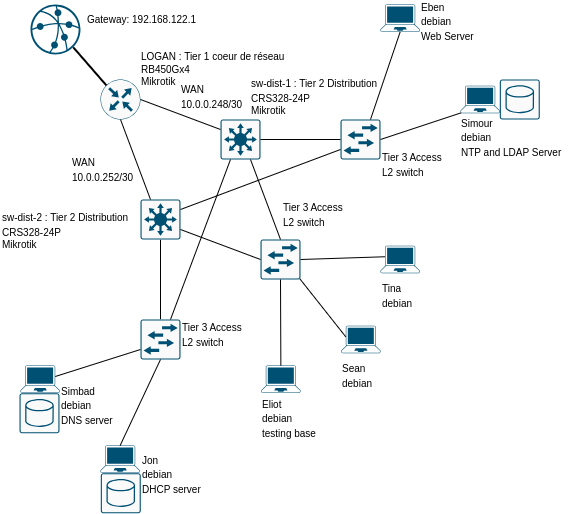
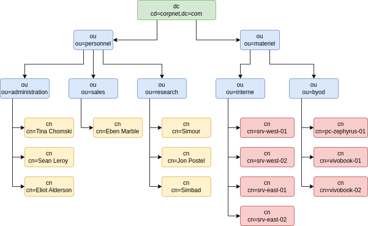

# Administration Système Linux: LDAP - gestion de services avancés


Il est temps de passer aux choses sérieuses. Ce sujet, prévu pour les deux jours à venir vise à déployer une infrastructure complète en trois tiers avec tous les services de gestion habiltuels dans un environnement Linux : une serveur de nom de domaine, une serveur d'adresses, un serveur d'annuaire et un serveur web.


## Détails techniques

### Schéma du SI

 

Le SI de CorpNet V.2.1

#### 1) Déploiement du SI

Déployez le SI de corpnet conformément au tableau ci-dessous :

| Nom | Système | configurations de base |
| :--- | :--- | :--- |
| LOGAN | Mikrotik RB450Gx4 | ether1 renamed external<br>address external 192.168.122.2/24<br>address ether4 10.0.0.249/30<br>address ether5 10.0.0.253/30<br>srcnat masquerade on external |
| sw-dist-01 | Mikrotik CHR328-24P | address ether1 10.0.0.250/30<br>bridge ether9,ether10,ether11<br>address bridge 192.168.200.1/24 |
| sw-dist-02 | Mikrotik CHR328-24P | address ether1 10.0.0.254/30<br>bridge ether9,ether10,ether11<br>address bridge 192.168.200.2/24 |
| sw-accs-01 | L2 switch | N/A |
| sw-accs-02 | L2 switch | N/A |
| sw-accs-03 | L2 switch | N/A |
| srv-west-01 | debian12 | address static 192.168.200.55/24<br>install isc-dhcp-server |
| srv-west-02 | debian12 | address persistent dhcp lease 192.168.200.53/24<br>install bind9 |
| srv-east-01 | debian12 | address persistent dhcp lease 192.168.200.90/24<br>install slapd ldap-utils|
| srv-east-02 | debian12 | address dhcp lease<br>install apache2 |
| workstation-01 | debian12 | address dhcp lease |
| workstation-02 | debian12 | address dhcp lease |
| workstation-03 | debian12 | address dhcp lease |


#### 2) Infrastructure

##### LOGAN

Il s'agit de ce que nous appellerons ici *coeur de réseau*.

- Assurez vous de pouvoir ping google.com

**troubleshooting :** vérifiez la présence de la route par défaut via 192.168.122.1

##### sw-dist-*

Ce sont les switchs du niveau distribution. Ce niveau est en général, dans les infrastructures modernes, en charge d'assurer la redondance de la connexion. 

Dans un premier temps, la configuration sera cependant statique. 

- Assurez vous de pouvoir ping google.com
- Assurez vous de pouvoir recevoir les pings de **LOGAN**

**troubleshooting :** vérifiez la présence de la route par défaut via 10.0.0.249/30 ou 10.0.0.253/30. Attention on cherche ici à déclarer des WAN, la taille du masque compte.

##### sw-accs-*

Le niveau access est ici modélisé par des switchs pour des raisons de facilité de manipulation à travers GSN3, dans la réalité il pourrait s'agir d'access point wifi par exemple.

Privilégiez des switchs L2 non-managés pour faciliter la mise en place. Tout autre systèmes, même configurable pourra être considéré si vous voulez essayer d'autres modèles.

#### 3) Deployment DHCP server

Après avoir installé le serveur **isc-dhcp-server**, configurez le lease DHCP : 

- Lease duration 24H
- Lease range 192.168.200.100 192.168.200.200
- Lease static pour srv-west-02 192.168.200.53/24 (par son adresse MAC)
- Lease static pour srv-west-03 192.168.200.90/24 (par son adresse MAC)

Restart DHCP serveur

#### 4) Deployment DNS server

Après avoir installé le serveur bind9

- Déclarez les deux zones (corpnet.com et 200.168.192.in-addr.arpa) dans le fichier de configuration de named. 
- Créez et complétez le fichier db.corpnet.com en précisant :
    - les adresses des serveur DNS (ajoutez 8.8.8.8 si nécessaire), 
    - l'addresse du serveur LDAP,
    - les adresses de gateway
- Créez et complétez le fichier db.200.168.192.in-addr.arpa en précisant les mêmes services.

Configurez la recursion et le forwarding pour que la résolution de nom de fasse correctement et que toutes les machines soient en mesure de ping google.com.

**IMPORTANT :**

N'importe quel poste de corpnet doit pouvoir résoudre les noms :
- srv-west-01.corpnet.com
- srv-west-02.corpnet.com
- srv-east-01.corpnet.com
- srv-east-02.corpnet.com 

L'adresse corpnet.com elle-même doit renvoyer vers le serveur DNS.

**Troubleshoting**

Bind9 dispose de commandes de validation des configurations :
- named-checkzone <domaine> <fichier>
- named-checkconf -z

Vérifiez les configuration bind9 et relancez le service.

#### 5) Deployment LDAP server

Après avoir installé slapd et ldap-utils, construisez la structure de l'organisation :

 

La façon la plus simple de procéder est de créer trois fichiers : structure.ldif, materiel.ldif et users.ldif.

Dans le fichier structure, renseignez l'organisation des unités organisationnelles. 

Dans le fichier users, précisez les utilisateurs en les rattachant aux *ou* correspondantes. 

Faites en de même avec les workstation (en byod) et les serveurs internes dans le fichier materiel. 

Attention à la gestion des MDP. La commande : 

```bash
slappasswd >> users.ldif
```

ajoutera le hash du mot de passe tapé par la suite directement à la fin du fichier users.ldif.

Assurez vous de la bonne prise en compte des entrées et relancez le service d'annuaire. 

Vous devez pouvoir consulter l'annuaire hébergé par srv-east-01.corpnet.com en tapant la commande : 

```bash
ldapsearch -x -LLL -H "ldap://srv-east-01.corpnet.com" -b dc=corpnet,dc=com
```

#### 6) Deployment Web server

Après avoir installé le serveur apache2, modifiez la page index.html pour afficher un site contenant la chaine de caractère <h1>CorpNet</h1>.

Relancez le serveur web. 

**Optionnel :** 
Vous pouvez vous aventurer à opérer la migration TLS pour finaliser la sécurisation du site. Assurez vous cependant que le site de corpnet est toujours accessible sur le port 80 en interne pour passer les tests.

#### 7) Deployment workstations

Assurez vous que les workstations joignent correctement le LDAP.

Installez nmap, dnsutils ainsi que les utilitaires nécessaires au client LDAP.

#### 8) Validation

Eliot doit pouvoir se connecter depuis n'importe quelle workstation au compte root de n'importe quelle workstation, et n'importe quel serveur via SSH (par clé, sans mot de passe).

Vous corrigerez par sentinel.

## Synthèse des items de validation

Vous aurez à ``git clone`` le projet sur la machine workstation-01 et à lancer le script ``sentinel`` de celle-ci. Le script
``sentinel`` vous générera un fichier ``tokens``
dans le dépôt et le poussera pour la validation. Cette machine doit
pouvoir se connecter sur toutes les machines (dont elle même) via
**SSH** avec le user ``root`` avec une authentification par
clefs, sans passphrase.

| item | details | conditions |
|---|---|---|
| Eliot | hostname<br>address<br>connectivité<br>nmap<br>ldap<br>workstation-01<br>workstation-02<br>workstation-03<br>srv-west-01<br>srv-west-02<br>srv-east-01<br>srv-west-02 | workstation-xx<br>192.168.200.100-200<br>ping google.com<br>installé<br>installé<br>ping workstation-01<br>ping workstation-02<br>ping workstation-03<br>ping srv-west-01<br>ping srv-west-02<br>ping srv-east-01<br>ping srv-east-02 |
| workstation-01 | hostname<br>address<br>connectivité | workstation-01<br>192.168.200.100-200<br>ping google.com |
| workstation-02 | hostname<br>address<br>connectivité | workstation-01<br>192.168.200.100-200<br>ping google.com |
| workstation-03 | hostname<br>address<br>connectivité | workstation-01<br>192.168.200.100-200<br>ping google.com |
| srv-west-01 | dhcp status<br>isc-dhcp-server<br>lease duration<br>lease range<br>static lease<br>routers<br>domain name servers<br>domain name | running<br>/etc/dhcp/dhcpd.conf<br>default-lease-duration 86400<br>range 192.168.200.100 192.168.200.200<br>fixed-address 192.168.200.90<br>option routers 192.168.200.1, 192.168.200.2<br>option domain-name-servers 192.168.200.53<br>option domain-name "corpnet.com" |
| srv-west-02 | bind9 status<br>bind9 server<br>configuration<br>named.conf.local<br>db.corpnet.com<br>db.200.168.192.in-addr.arpa | running<br>/etc/bind/<br>présence des fichiers<br>zones correctes<br>serveur et gateway<br>serveur et gateway |
| srv-east-01 | ldap status<br>configuration<br>users<br>users<br>users<br>users<br>users<br>users<br>users | running<br>cn=config<br>found eliot<br>found sean<br>found tina<br>found eben<br>found jon<br>found simbad<br>found simour |
| srv-east-02 | apache2 status<br>configuration<br>content | running<br>/etc/apache2<br>CorpNet |


## Ressources

-   [\[DigitalOcean sur la connexion SSH par clé\]](https://www.digitalocean.com/community/tutorials/how-to-configure-ssh-key-based-authentication-on-a-linux-server)
-   [\[LinuxTricks sur le déploiement d'un serveur DHCP\]](https://www.linuxtricks.fr/wiki/debian-installer-un-serveur-dhcp)
-   [\[Debian Wiki sur le déploiement d'un serveur bind9\]](https://wiki.debian.org/fr/NetworkConfiguration)
-   [\[Debian Wiki sur le déploiement de LDAP\]](https://wiki.debian.org/LDAP/OpenLDAPSetup#Initial_Installation)
-   [\[La doc Mikrotik\]](https://help.mikrotik.com/docs/spaces/UM/pages/8978698/User+Manuals)
-   [\[Configuration client LDAP\]](https://doc.ubuntu-fr.org/ldap_client)
-   [\[Une doc de l'INRIA sur LDAP\]](https://www-sop.inria.fr/members/Laurent.Mirtain/ldap-livre.html)


