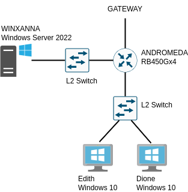

# Administration Système Windows: Déploiement d'un Windows server


`CorpNet` doit s'étendre.

Suite à l'acquisition de nouveaux locaux, vous êtes en charge du déploiement
du réseau des nouveaux bureaux. Le routage est déjà fait, vous devez gérer 
le réseau au niveau L2, déployer un Domain Controller et configurer les 
machines Windows.

Cette série d'exercices autour des technologies Microsoft est indépendante 
de la séquence précédente.


## Détails techniques

### Schéma du SI


 
Le SI de CorpNet V.1.2

## Routage

Votre première tache consiste à router correctement le sous-réseau des nouveaux
locaux. 
Le routeur `ANDROMEDA` est un Mikrotik RB450Gx4 que vous connaissez déjà.

| interface | Usage |
| :--- | :--- | :--- |
| ether1 | GATEWAY | 
| ether2 | Domain Controller |
| ether3 | Office |

Le routeur se vera attribuer un bridge avec l'adresse 138.55.55.1/24

## Configuration du Windows server
-------------------------------

### 1) Déploiement de Windows Server 2022

![pics/screen_install.png]

- Renommez le serveur `WINXANNA`
- Donnez à Administrateur le mot de passe *P4ssw0rd* (important pour la correction)
- Activez la gestion à distance
- Activez le bureau à distance
- Vérifiez la timezone

le switchs utilisés (`GALATEA` et `CALIPSO`) sont des switchs non-managés (disponibles par défaut dans GNS3).

### 2) Configuration des paramètres réseau

- Configurez l'interface réseau avec l'adresse `138.55.55.55`
- Configurez le masque de sous réseau `255.255.255.0`


### 3) Configuration des rôles et fonctionnalités

- Configurez l'AD DS
    - créez une nouvelle forêt pour corpnet
- Configurez le DNS
    - Domain Name : `corpnet.com`
- Configurez le DHCP
    - plage IP : `138.55.55.100` - `138.55.55.200`
    - bail : 24H (1 jour)
- Créez les comptes utilisateurs :
    - Security groupe `IT` :
        - Sean Leroy (seanleroy),
        - Eliot Alderson (eliotalderson),
        - Tina Chomski (tinachomski),
        - Jon Postel (jonpostel),
        - Simbad Chamberlin (simbadchamberlin),
        - Eben Marble (ebenmarble),
        - Xanna Medvedva (xannamedvedva)
    - Security groupe `Sales` :
        - Demeter Paterson (demeterpaterson),
        - Edith Simpson (edithsimpson),
        - Dione Malouin (dionemalouin)

## Configuration des machines utilisateur

- Créez deux machines Windows 10 pour Edith et Dione. 
- Configurez les pour prendre une adresse en DHCP à Xanna.
- Configurez le DNS pour pointer vers Xanna.
- Pour ces deux machines, joignez l'Active Directory.
- Verifiez qu'Edith peut ouvrir une session PowerShell à distance sur Xanna.

## Prise en main du CMD

Sur Xanna, utilisez Net User pour ajouter un utilisateur `maintainer` dont le mot de passe est `P4ssw0rd`.
N'oubliez pas de créer les répertoires correspondants.


### 1) Gestion des paramètres de connexion

Créez un script `C:/Users/maintainer/Documents/setnet.bat` de configuration de l'interface réseau :

- si `setnet.bat` est appelé sans option, alors il fait une demande de lease au serveur DHCP
- si `setnet.bat` est appelé avec une adresse IP valide en option, alors elle est mise à jour en static
- si `setnet.bat` est appelé avec une adresse IP non valide ou des options incohérentes, alors un message d'erreur est généré

Dans les trois cas le programme log son fonctionnement dans un fichier `C:/Users/maintainer/Documents/netlog.txt`

Le pattern des entrées du fichier de log est donné ci-dessous :

- "SUCCESS <address> STATIC"
- "FAILURE <address> invalid"
- "SUCCESS DHCP request"
- "FAILURE DHCP request"

Exécutez le script au moins une fois.


### 2) Monitoring System

Créez un script `dumpstate.bat` qui devra écrire le résultat des commandes suivantes dans un fichier `C:/Users/maintainer/Documents/dump.txt` :

- La configuration des interfaces réseau IPv4
- Un scan des volumes mémoires attribués au serveur
- La liste des processus en cours d'exécution
- L'état et l'usage courant du CPU

Exécutez le script au moins une fois.

## Synthèse des items de validation

### Configuration

Vous aurez à `git clone` le projet sur `Xanna` et à lancer le script `sentinel` de celle-ci.

Pour ce faire :

- installer git, python3, requests (librairie python)
- dans un powershell lancer
    
```powershell
Invoke-WebRequest sentinel.int.ecole[SUPPRIME_2600].com/download/latest -Outfile sentinel
```

- créer un dossier .ssh dans /Administrator, y mettre la clé rsa et le fichier config nécessaire pour `git clone`

Le script `sentinel` vous générera un fichier `tokens` dans le dépôt et le poussera pour la validation.

### Validation

| item          | details                   | condition                         |
| :---          | :---                      | :---                              |
| Xanna setup   | hostname<br>OS name<br>OS configuration<br>domain<br>admin<br>user Eliot<br>user Eben | WINXANNA<br>Windows Server 2022<br>Domain Controller<br>corpnet.com on primary DC<br>Administrator exists<br>Eliot Alderson exists<br>Eben Marble exists
| Network       | static ip<br>firewall<br>sub-network<br>dhcp<br>dhcp scope<br>dhcp lease<br>arp table<br>arp broadcast<br>gateway | 138.55.55.55<br>set for private network<br>netmask 255.255.255.0<br>enabled<br>138.55.55.100-200<br>1 jour<br>has gateway<br>138.55.55.255<br>138.55.55.1 |
| Edith setup   | hostname<br>OS name<br>domain<br>network | Edith<br>Windows 10<br>Member of corpnet.com<br>IP in range 138.55.55.100-200 |
| Dione setup   | hostname<br>OS name<br>domain<br>network | Dione<br>Windows 10<br>Member of corpnet.com<br>IP in range 138.55.55.100-200 |
| batch<br>scritping | found setnet.bat<br>found netlog.txt<br>find pattern for SUCCESS<br>find network information<br>find basic configuration<br>find resources information          | in maintainer/Documents<br>in maintainer/Documents<br>in netlog.txt<br>in dump.txt<br>in dump.txt<br>in dump.txt          |

## Ressources

* (Developpez.com sur les commandes batch)[https://windows.developpez.com/cours/ligne-commande/?page=page_4>]
* (Documentation officielle Microsoft Windows Server 2012)[https://learn.microsoft.com/fr-fr/windows-server/get-started/get-started-with-windows-server]
* (Wikibook des commandes batch)[https://en.wikibooks.org/wiki/Windows_Batch_Scripting>]
