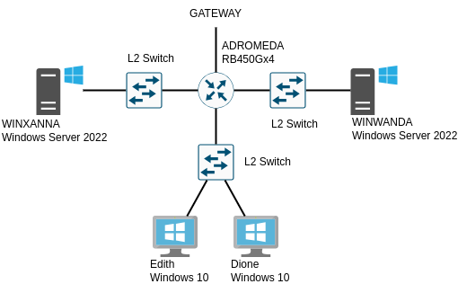

# Administration Système Windows: Déploiement d'un serveur IIS sécurisé


Pour premettre aux membres de `Corpnet` d'être productifs depuis n'importe 
où dans le monde, le besoin a été formulé de développer une stratégie zero-trust.
A ces fins, vous devrez déployer une interface web qui pourra servir de support
à un SSO.


## Détails techniques

### Schéma du SI

 

Le SI de CorpNet V.1.2

## Configuration préalables

Ajoutez un switch pour matérialiser la division web, nommez le `ALCYONE`.

### 1) Configuration du serveur de certificat

Sur `WINXANNA`, déployez le nouveau rôle : Certificate Services (AD CS).
Générez un nouveau certificat autosigné en `SHA512` avec une clé de 4096 octet.

Vous allez devoir créer un certificat autosigné en utilisant les outils powershell
comme `New-SelfSignedCertificate` et l'exporter manuellement à la fois pour 
générer la première forêt de CorpNet et pour permettre la navigation en HTTPS.

L'IHM microsoft ne permet pas de configurer ce type de services dans un lab
sans connexion à un certificat racine.

### 2) Configuration de la fédération à `WINXANNA`

Pour économiser les ressources de la simulation, le serveur de fédération 
sera installé sur la même machine que le serveur de certificat.

Utilisez le certificat généré par WINXANNA pour configurez le premier serveur 
de fédération de `CorpNet`.
 
- Importez le certificat généré plus haut
- Donnez le nom "Corporation Network" à la forêt
- Utilisez le compte administrateur pour gérer la forêt
- Générez le certificat racine de la forêt
- Mettez à jour les règles du pare-feu

## Configuration du serveur IIS

### 1) Déploiement de Windows Server 2022

- Connectez le au switch `CALIPSO`
- Renommez le serveur `WINWANDA`
- Donnez à Administrateur le mot de passe *P4ssw0rd* (important pour la correction)
- Activez la gestion à distance
- Ajoutez `WINWANDA` dans l'AD 

### 2) Configuration des paramètres réseau

- Configurez l'interface réseau avec l'adresse `138.55.55.66`
- Configurez le masque de sous réseau `255.255.255.0`


### 3) Configuration des rôles et fonctionnalités

- Configurez le serveur IIS pour que la racine du site se trouve au chemin
`C:\www`.
- Placez-y un fichier `html` comprenant la chaine de caractère `CorpNet` a minima.
- Configurez la liaison sur le port 443 de manière à autoriser la connection
en https.

La commande pour transférer un certificat d'un serveur à l'autre est 

```powershell
CopyItem -Path <source> -Destination <destination>
```

## Configuration des services
--------------------------

### 1) Création et gestion d'un partage

Sur `Edith`, créez un dossier `C:/SharedFolder`.
Configurer les permissions de partage et donnez les accès suivants :

- FullAccess Administrators
- ReadAccess Users

Modifier les ACL du dossier partagé pour que `maintainer` puisse en modifier le contenu.

- ReadAndExecute Users
- Modifier les ACL du dossier partagé pour que `maintainer` puisse en modifier le contenu.

L'administrateur doit avoir accès au contenu de ce dossier depuis `Wanda`. 

Placez dans le dossier partagé un export du certificat racine du serveur de certificats.

### 2) Paramétrage de la console Powershell

Toutes les modifications faites dans la suites sont faites sur `Xanna` sous profile `Administrator`.

Créez un script powershell pour changer l'apparence de powershell dans '\Documents\prompt.ps1':

- Le titre de la fenêtre powershell par défaut devra être "WIN-XANNA"
- Le background doit être noir ou rouge:

  - Si le background est noir, le premier plan doit être gris
  - si le background est rouge, le premier plan doit être jaune

- Définissez l'alias `status` qui doit appeler systeminfo.exe
- Définissez l'alias `rules` qui doit renvoyer les règles de firewall
- Créez la fonction `Get-UserNumber` qui renvoie la date au format Jour.*Numero.*Mois.*Année.*HH:MM et le nombre d'utilisateurs configurés
- Modifier le prompt :

  - Faites en sorte que votre Powershell n'affiche plus le chemin, mais le nombre de commandes dans l'historique et la date complète (JJ/MM/AAAA HH:MM:SS) dans une couleur différente du foreground que vous avez choisi.


Assurez vous que le nouveau profile que vous avez défini soit actif pour tous les utilisateurs
de Toma et soit persistent (fermer et ré-ouvrir le Powershell doit conserver les modifications).

Faites une copie du script dans `C:/SharedFolder`.

### 3) Gestion du firewall

Sur `Xanna`, créez un nouveau script `C:/SharedFolder/EmergencyUndo.ps1`
dans lequel vous écrierez au fur et à mesure les commandes permettant de
revenir à la configuration initiale.

Les modifications faites dans la suite doivent être valables pour les profiles
`Private` et `Domain`.

- Installez Firefox sur Xanna.
- Toutes vos règles de firewall doivent avoir un DisplayName préfixé par "[ASR5] ", la suite du nommage reste libre.
- Mettez à jour les règles de firewall pour bloquer toute connexion sortante d'Internet Explorer. Mettez la mention `Internet Explorer` dans le DisplayName de la règle.
- Ajoutez à `EmergencyUndo.ps1` les commandes nécessaire pour autoriser les connexions depuis Internet Explorer.
- Fermez les connexions RDP. Mettez la mention du protocole dans le DisplayName de la règle
- Ajoutez à `EmergencyUndo.ps1` les commandes nécessaire pour autoriser les connexions RDP.
- Fermez les réponses aux ECHO ICMPv4 et v6 provenant de l'extérieur (n'autorisez les que pour les adresses du sous-réseau 138.55.55.0/24). 
- Mettez la mention `Network Exploration` dans le DisplayName des règles.
- Ajoutez à `EmergencyUndo.ps1` les commandes nécessaire pour revenir à l'état précédent.
- Fermez toute connexion HTTP et HTTPS vers `Toma` depuis le réseau extérieur. Mettez la mention `Web Browsing` dans le nom ou la description des règles.
- Ajoutez la règle correspondante à `EmergencyUndo.ps1`

Organisez le script `EmergencyUndo.ps1` de façon à ce qu'il puisse être appelé avec un argument
permettant de choisir une règle du firewall à réinitialiser.

Assurez vous que votre firewall ne bloque pas le protocole SMB au sein du sous
réseau de CorpNet.

## Synthèse des items de validation

### Configuration

Vous aurez à `git clone` le projet sur `Xanna` et à lancer le script `sentinel` de celle-ci.

Pour ce faire :

- installer git, python3, requests (librairie python)
- dans un powershell lancer

```
  Invoke-WebRequest sentinel.int.[ECOLE_SUPPRIMEE].com/download/latest -Outfile sentinel
```

- créer un dossier .ssh dans /Administrator, y mettre la clé rsa et le fichier config nécessaire pour `git clone`

Le script `sentinel` vous générera un fichier `tokens` dans le dépôt et le poussera pour la validation.

### Validation


| item          | details                   | condition                         |
| :---          | :---                      | :---                              |
| Xanna         | hostname<br>OS name<br>OS configuration<br>domain<br>Root certificate | WINXANNA<br>Windows Server 2022<br>Certificate Server<br>corpnet.com<br>detected |
| Wanda         | hostname<br>OS name<br>OS configuration<br>domain<br>ip address | WINWANDA<br>Windows Server 2022<br>Web Application Server<br>Member of corpnet.com<br>138.55.55.  |
| PowerShell  | Powershell profile<br>WindowTitle<br>Colors<br>Alias<br>Alias<br>Function<br>prompt modifications<br>prompt modifications<br>prompt modifications | persistent<br>EDITH<br>Black/Grey or Red/Yellow<br>status<br>rules<br>Get-UserNumber<br>Include date<br>Include History count<br>Different color |
| Firewall    | script<br>install<br>Firewall Internet explorer<br>Firewall RDP<br>Firewall ICMPv4<br>Firewall ICMPv6<br>Firewall HTTP<br>Firewall HTTPS<br>script Internet explorer<br>script RDP<br>script ICMPv4<br>script ICMPv6<br>script HTTP<br>script HTTPS | EmergencyUndo.ps1 found<br>Firefox found<br>traffic blocked<br>outside traffic blocked<br>traffic blocked toward outside<br>traffic blocked toward outside<br>outside traffic blocked<br>outside traffic blocked<br>traffic allowed<br>outside traffic allowed<br>traffic allowed toward outside<br>traffic allowed toward outside<br>outside traffic allowed<br>outside traffic allowed |
| Shared<br>folder | Folder exists<br>SMB share<br>Permissions<br>ACL | C:/SharedFolder<br>initialized<br>conform<br>conform |      

## Ressources


* (Developpez.com sur les commandes batch)[https://windows.developpez.com/cours/ligne-commande/?page=page_4]
* (Documentation officielle Microsoft Windows Server 2012)[https://learn.microsoft.com/fr-fr/windows-server/get-started/get-started-with-windows-server]
* (Wikibook des commandes batch)[https://en.wikibooks.org/wiki/Windows_Batch_Scripting]
